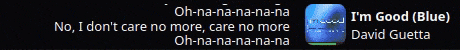
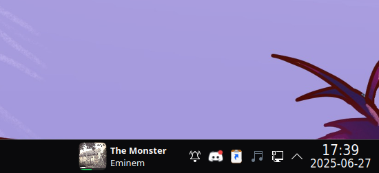
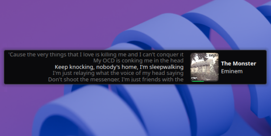
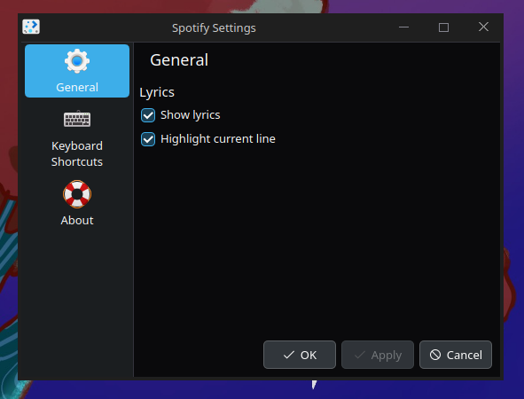

# Fork of KDE Plasma Spotify Plasmoid

This fork only adds functionality for desktop plasmoid. I have not, nor do I intend to, tested functionality with lyrics and on an app-bar.

## Extra features
- Respects the user defined width of the plasmoid
- Scrolls the title and artist name on hover if it overflows
- Adds shift+scroll as previous/next song
- Adds click to launch spotify if its not already launched
- Lets the progress bar take up entire width of widget instead of only the artwork


# KDE Plasma Spotify Plasmoid

A KDE Plasma widget that displays the current song playing on Spotify along with its lyrics, synchronized in real-time.<br>
This plasmoid is designed to be lightweight and efficient without impacting system resources.



## Features

- **Album Artwork**: Displays album art for the currently playing track.
- **Song Details**: Shows the song title and artist name.
- **Song Progress Bar**: A visual indicator of the song's playback progress.
- **Synchronized Lyrics** Animated lyrics scroll in sync with the song progress, powered
  by [lrclib.net](https://lrclib.net).
- **Playback Controls**: Middle-click to play or pause the song.
- **Volume Control**: Adjust volume using the scroll wheel.

## Installation
### KDE Store Installation
You can easily install the Spotify plasmoid from the [KDE Store](https://store.kde.org/p/2265660)

### Manual Installation
1. **Copy Files**
   Copy the contents of the src folder to your local plasmoid directory:

```bash
mkdir -p ~/.local/share/plasma/plasmoids/spotify/
cp -r src/* ~/.local/share/plasma/plasmoids/spotify/
```

2. **Restart Plasmashell**
   To activate the plasmoid, restart the Plasmashell process:

```bash
kquitapp5 plasmashell && kstart5 plasmashell
```

Your plasmoid should now be available to add to your KDE Plasma panel or desktop.

## Images




### Inspiration

This project was inspired by:

- [lyrics-on-panel](https://github.com/KangweiZhu/lyrics-on-panel)
- [plasmusic-toolbar](https://github.com/ccatterina/plasmusic-toolbar)